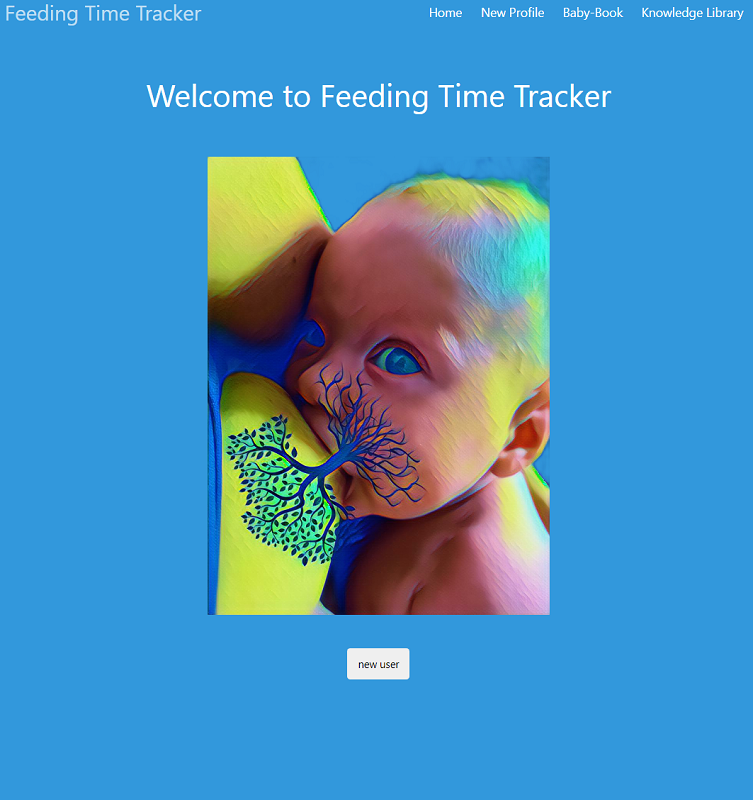

# Feeding Time Tracker
## A minimal breastfeeding tracking app

## Summary

The feeding time tracker is a web app that helps mothers manage breast feeding their children. It allows them to easily know which breast they should next feed their child on. Mothers that breastfeed, express or pump face the task of manually tracking which breast they should next feed their child on. Alternating the breast a baby is fed on may seem a trivial detail, however the health benefits of doing so are profound. Besides helping to build up a healthy supply of breast milk, alternating breasts can help a baby nurse longer, provide more breast milk at each feeding to a newborn who needs to gain weight, and even helps to prevent serious disease like mastitis.

## Current Features
- Login and see a record of when you last breastfed.
- Keep track of which breast was last used.
- Keep track of important baby details in the 'Baby Book'.
- User details saved to local storage.
- Inspirational quote of the day displayed during feeding.
- Knowledge page with general wikipedia information and links to external resources.

## Planned Features
- Easily record baby weight with custom widget.
- Timer to easily keep track of feeding time.
- Accomodate multiple users.
- Take notes on mothers diet and medication.
- Take notes on how well baby fed.
- Inbuilt media and entertainment.
- White noise generator.
- Record baby's length.
- Sign in with social media account.

## Technologies Used
- HTML / CSS / JavaScript
- moment.js
- Local Storage
- BULMA CSS Framework
- 'Wikipedia' Server-side API
- 'They Said So' Server-side API

## Deployment  
- This Project has been deployed to Github and is live on Github pages.
 
- Link to the deployed webpage: https://yurikitchin.github.io/Project1-FeedingTimeTracker/

- Github Repository that contains the code: https://github.com/yurikitchin/Project1-FeedingTimeTracker

- 'They Said So' is the server-side API used to fetch inspirational quotes of the day https://theysaidso.com/

- Google Presentation Slide deck may be found here https://docs.google.com/presentation/d/1geIAblpy1-8xYXnf-1V8h-2QwottIjb0VRg37zG52uw/edit?usp=sharing

- 'Wikipedia' is the server-side API used to fetch general breastfeeding information https://www.mediawiki.org/wiki/API:Main_page 

## Contributers
- Norman Bernard https://github.com/Normksb
- Brett Treweek https://github.com/brett-treweek
- Yuri Kitchin https://github.com/yurikitchin
